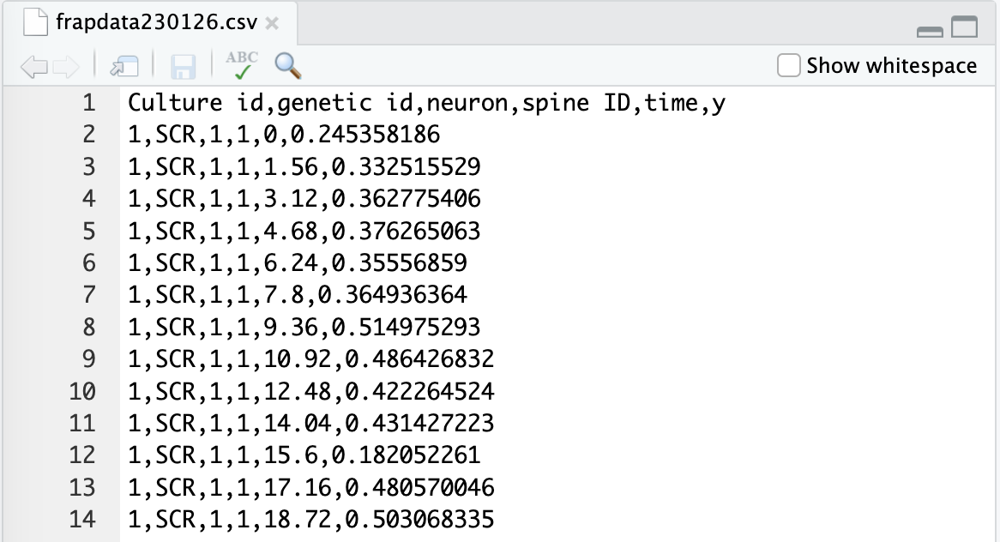
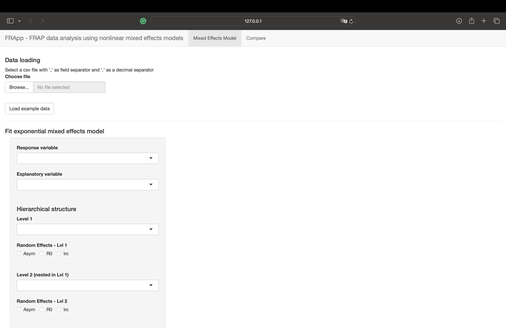

# FRApp

<!-- badges: start -->
<!-- badges: end -->

FRApp offers a grafical interface to fit nonlinear mixed-effects models
to analyze actin dynamics in dendritic spines that can be described by
an asymptotic exponential curve over time.

Statistical analysis of FRAP data must account for the nested
hierarchical structure of FRAP experiments, where multiple spines belong
to the same neuron, and different neurons are derived from one of the
cultures. In the mixed-effects model framework, this is allowed by the
random effects structure.

Moreover, the effect of an experimental condition can be evaluated at
different levels including interactions with fixed or random effects,
and with the variance coefficient.

## Installation

To use the application first download and install R and Rstudio from
[posit.co](https://posit.co/download/rstudio-desktop/).

You can install the package executing the following commands from the
RStudio Console:

``` r
install.package("FRApp")
```

You can install the development version of FRApp from
[GitHub](https://github.com/) with:

``` r
# install.packages("devtools")
devtools::install_github("gioiadc/FRApp")
```

## Data preparation

Save the data in a csv file with a comma as a separator and a period as
a decimal separator. The first line of the file must contain the name of
the variables.

If the data is in an Excel file, you can export it by selecting the
format:

CSV UTF-8 (Comma-delimited) (.csv)

When you open the csv file with a text editor it should look like this:

<figure>

<figcaption aria-hidden="true">Data example screenshot</figcaption>
</figure>

## Launch the Shiny app

To load the package and make the functions available to be used run the
command:

``` r
library(FRApp)
```

To launch the Shiny app, copy and paste the following code in the
console. The application opens automatically in the browser.

``` r
FRApp()
```

<figure>

<figcaption aria-hidden="true">Shiny app example screenshot</figcaption>
</figure>

## Use the ShinyApp

The ShinyApp has two tabs, Mixed Effects Model and Compare. The first
allows you to: - load the data - estimate the model - print a model
report - export the data and the model - save the estimated models for
model comparison

The second tab compares saved models using information criteria and
likelihood ratio test, when appropriate.

## Import data

The first section of the application allows you to load the file
containing the data to be analyzed using the *Browse…* button. Check the
correct import through the summary description of the imported variables
and the number of imported observations on the right.

The response variable must be numeric (num), and the explanatory
variable can be integer or numeric (num or int). Make sure they have not
been loaded as factors. If so, check the encoding of the imported file
and/or the presence of the name of the variables as the first line of
the file.

The *Load example data* button allows you to load the dataset analyzed
in the paper and automatically select the specifications of the model
presented.

## Variable selection and fit

The left part of the application is dedicated to selecting the
specifications of the model you want to estimate.

### Response and explanatory variables

Select the response variable (e.g., intensity recovery) and the
explanatory variable (e.g., time) from the drop-down menu.

### Hierarchical structure and random effects

In the same way, select the levels of the hierarchical structure
starting from the highest. For example, for data on spines nested in
neurons and nested in cultures, the first level will be the culture, the
second the neuron, and the third the spine. It is possible to specify up
to 3 hierarchical levels, but it is optional to set them all. For each
specified hierarchical level, you must select at least one random
effect.

### Variance and autocorrelation functions

The variance section allows you to specify variance functions to model
heteroscedasticity error assumption. The default function is Constant,
which represents the assumption of constant error variance.

The temporal dependence section allows you to select the order of an
autoregressive model on errors. The default value is 0, which represents
the assumption of error uncorrelation.

### Interactions with experimental conditions

The last section includes the interactions between the experimental
condition (e.g., genetic condition) and several model parameters.

Choose the variable’s name representing the experimental condition from
the drop-down menu.

The interactions that can be modeled are those between the levels of the
experimental condition and: - the parameters of the fixed effects; - the
random effects parameters for each specified level; - the parameters of
the variance function.

## Model estimation

The *Fit the model* button allows you to estimate the model. At the end
of the estimation process, the following will appear on the right side
of the application: - summary information of the model - the scatterplot
of the residuals vs the estimated values - the quantile-quantile plot of
the residuals - the approximate 95% confidence intervals

The *Download report* button allows you to export the results printed in
the application (model summary, residual graphs, and intervals) into a
PDF document.

The *Download RData* button allows you to export to an RData file
containing six objects: - data: the dataset in the format used for the
analysis - fit: the output of the estimated model - pred: the values
estimated by the model - CI: the approximate 95% confidence intervals -
resid: the residuals of the model - raneff: random effects for different
hierarchical levels

You can open the Rdata file with Rstudio, and use the objects to create
further graphs (curves estimated at different levels, residual or random
effects graphs).

In the last section, it is possible to specify a name for the estimated
model and, with the *Add to model list* button, save it in the list of
models to compare. Saved models must have different names. The *Reset
model list* button allows you to empty the saved model list.

## Compare fitted models

The second page of the application, Compare, allows you to compare the
saved models by selecting them from the drop-down menu. Once the models
are selected from the list, the

## References

As a reference to the construction of the model and the different
options to specify, we refer to the book: Pinheiro, J., & Bates, D.
(2006). Mixed-effects models in S and S-PLUS. Springer science &
business media.
