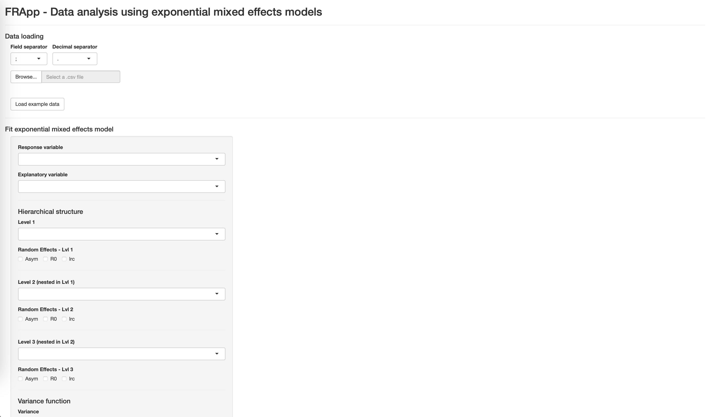
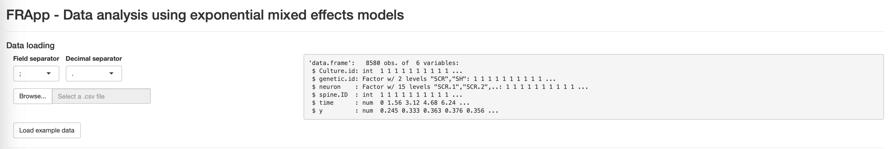
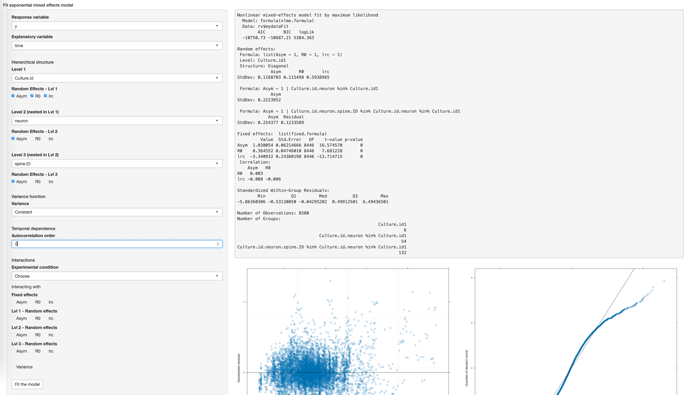
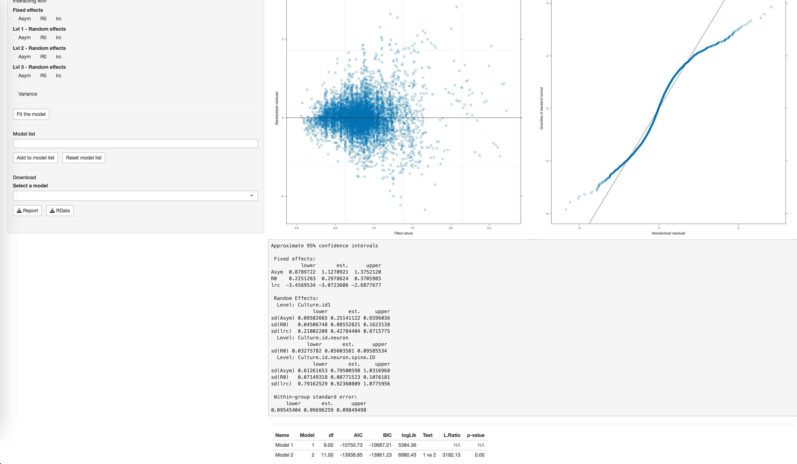
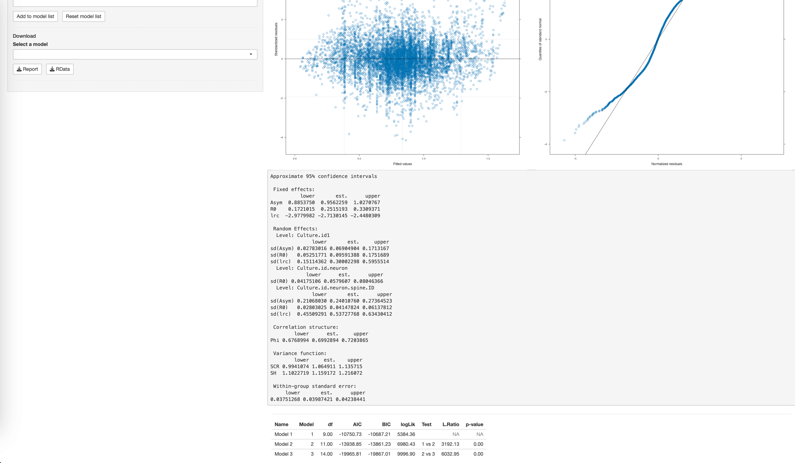
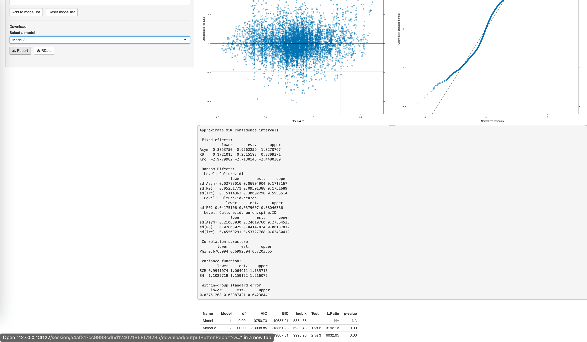

```{r, include = FALSE}
knitr::opts_chunk$set(
  collapse = TRUE,
  comment = "#>"
)
```

FRApp is an R package designed to streamline the analysis of Fluorescence Recovery 
After Photobleaching (FRAP) experiments, specifically focusing on actin dynamics in dendritic spines. 
This vignette provides a comprehensive guide on using FRApp for fitting nonlinear 
mixed-effects regression models and analyzing the results, briefly describing the analysis of the example data included in the package. 

However, it is important to note that FRApp is not limited to FRAP data analysis. 
The package offers a versatile framework for fitting nonlinear mixed-effects models with an asymptotic exponential functional relationship to hierarchical data in various domains. 
Whether you are dealing with experimental data in biology, ecology, or any other 
field where hierarchical structures are present, FRApp can be a valuable tool 
for efficient model fitting and visualization.

In the FRAP experimental paradigm, the estimation of recovery curves over
time is integrated with a nested data structure of spines belonging to
neurons and neurons belonging to cultures. In the mixed-effects model
framework, this structure is modeled through random effects.

Moreover, the effect of an experimental condition, e.g., the
downregulation of the actin-binding protein CAP2 on actin dynamic, can
be evaluated at different levels, including interactions with fixed and
random effects and the variance coefficient.
The autocorrelation structure over time can also be modeled by an
autoregressive model.


## Installation

To install FRApp, you can use the following command
  
```{r, eval=F}
install.packages("FRApp")
```

Load the library with the command
```{r}
library("FRApp")
```

You must execute this command every time you restart Rstudio.

## Data Organization and preprocessing

Users need to ensure that their data follows a suitable structure for analysis. 
FRApp expects hierarchical data organized with grouping levels that uniquely 
identify the hierarchical structure.

Data should be organized with hierarchical levels that, when combined, distinctively identify the units at the lowest level of the hierarchy.

If applicable, experimental conditions should be included in naming the highest 
level of the hierarchy to which they are applied.

As an example, the FRApp package includes sample FRAP data, which can be loaded 
in R using the following code:
  
```{r}
data(FRAPdata)
```

The function \texttt{head} prints the first six lines of the dataset.

```{r}
head(FRAPdata)
```

The FRAP dataset uses the following naming convention to identify spines grouped 
in the three nested levels:
  
- Culture.id: Identifies the culture
- neuron: Identifies the neuron and its genetic condition. When combined with 
Culture.id identifies uniquely each neuron.
- spine.ID: Identifies the spine. When combined with Culture.id and neuron 
identifies uniquely each spine.

Please notice that using this naming convention, spines can be identified only 
specifying the complete hierarchical structure, i.e. culture/neuron/spine.
Therefore, if you want to fit a model including random effects only at spine levels, 
you have to assign a unique name to each spine, otherwise they will not be identified.

When data are ready can be exported in a csv file. Make sure that the first line of the csv file contains variable names and take note of the field and decimal separators.

## Fitting Nonlinear Mixed-Effects Regression Models

Launch the FRApp application with the command

```{r, eval = F}
FRApp()
```

<center>
{width=90%}
</center>

The application allows you to: 
  
- [Load the data] 

- [Estimate and compare exponential mixed-effects models]

- [Print a model report and export the data and the model] 

The application automatically opens in the browser. While the application is running, the console is not accessible. To close the application and regain access to the console, you have to click on the red stop button located in the top right corner of the frame of the R console.

### Load the data

The FRApp application accepts csv files. By default, it uses the semicolon as the field separator and the period as the decimal separator, but you can select different separators from the drop-down menu. 

The first line of the file must contain the variable names.

The *Browse…* button allows you to load your own data file to be analyzed. Check that your import is correct by looking at the summary description of the variables and at the number of observations imported on the right.

Please, double-check variable types:

- the response variable must be numeric (num)

- the explanatory variable, e.g. time, can be either integer (int) or numeric (num). 

For response and explanatory variables *factor* variable type is not allowed.

Alternatively, to showcase the functionality and usability of FRApp, the *Load example data* button allows you to load the dataset analyzed in the paper and automatically selects the specification of the final selected model. 

Loading the example data, the response variable y, the fluorescence intensity, and the explanatory variable time are numeric.

<center>
{width=90%}
</center>

### Estimate and compare exponential mixed-effects models

The following list highlights the main characteristics of an exponential mixed-effect model that can be implemented in the FRApp and link them to the FRAP data analysis.

Fit is perfomed with the function <tt>`nlme`</tt>.

**Fixed effects**<br/>
For each unit, the response variable $y$ is modeled through an asymptotic regression function on time $t$, that is,
$$y_i = Asym+(R0−Asym)exp(−exp(lrc)t_i)+\epsilon_i,\quad  \text{for } i = 1,...,n$$
This asymptotic function is characterized by three parameters: $R0$, the response $y$ at time $t = 0$, the horizontal asymptote $Asym$ (reached for $t \rightarrow \infty$) and the log rate constant $lrc$.<br/>

- FRApp: Begin by selecting the response variable and the explanatory variable from the drop-down menu.<br/>

- Example data: In the context of our example analysis, the fluorescence intensity $y$ is the response variable and the $time$ is the explanatory variable. The model parameters have a biological interpretation in describing the actin cytoskeleton dynamics in spines. In detail, $R0$ is the fluorescence intensity after photobleaching, $Asym$ is the fluorescence intensity recovered in time, and $lrc$ measures how fast the fluorescence intensity recovers.


**Random effects**<br/>
Mixed-effects models combine fixed effects describing the population mean and random effects accounting for variation among groups. When data present a nested structure, the hierarchy can be easily handled specifying random effects for each level of the hierarchy. In the FRApp, random effects are assumed to be independent and normally distributed.<br/>

- FRApp: Choose the hierarchical structure levels, starting with the highest level. You can specify up to three hierarchical levels. For each specified hierarchical level, you must select at least one random effect. 
There is no set rule for constructing the random effect structure. You can begin by defining a structure that best captures the expected variability between groups. Alternatively, you can fit the initial model with total random effects and adjust it by removing unnecessary random effects, i.e. those with variability almost close to zero.
<br/>

- Example data: In our case, the parameters $Asym$, $lrc$, and $R0$ are expected to vary across cultures, neurons, and spines, which are organized in a hierarchical structure, i.e., spines (level 3) within neurons (level 2) within cultures (level 1). Therefore, we can specify a random effect for each level-specific parameter to capture the variability among entities belonging to the same group, e.g. the random effect on Asym at the culture level describes the variability among asymptotes of different cultures. 


**Variance and temporal dependence**<br/>
When model residuals, that are the difference between fitted and observed values, show a non constant behavior, several variance functions can be evaluated to account for the heteroscedasticity. Also, the temporal dependence among data can be modeled introducing an autoregressive (AR) step.<br/>

- FRApp: Select the variance function from the drop-down menu. The variance section allows you to specify different variance functions to model the heteroscedasticity of the error term. The default function is *Constant*, which represents the assumption of constant error variance. The temporal dependence section allows you to select the order of an autoregressive model on the error term. The default value is 0, which corresponds to the uncorrelated errors structure.<br/>

- Example data: Examining the residuals, we evaluate the presence of heteroscedasticity, modeled with non constant variance function. Our example data are recorded on time, so we expect that a temporal dependence among data is present.

**Interactions**<br/>
Interactions with an experimental condition can be included with different model components: random effects, fixed effects, and variance structure. Interactions allow to estimate effects for different experimental conditions.<br/>

- FRApp: Select the variable representing the experimental condition from the drop-down menu and choose the interaction to include in the model.<br/>

- Example data: The experimental condition, is indicated as genetic.id, being the main effect of interest in the data analyzed in the paper.

If uncertain, it's advisable to start with the simplest structure and progressively work towards greater model complexity. Assess model diagnostics including residual plots, random effects normality, and serial correlation.

You can save models for model comparison. Saved models must have different names. When multiple models are saved, the table at the bottom of the page displays comparisons among the saved models using AIC, BIC, and likelihood ratio tests.

The *Reset model list* button allows you to delete the saved models from the list.

#### FRAP example data analysis

In this section, we walk through an example analysis of the FRAP dataset using FRApp. 

**Model 1** We start fitting a model with three random effect at Culture level and one random effect on the $Asym$ parameter on the neuron and spine levels. We consider a constant variance function and no temporal dependence on the error term. Also we do not evaluate interactions with the genetic condition.<br/> 

At the end of the estimation process, we obtain:

- summary of the model that includes parameter estimates and model information

- scatterplot of residuals vs. estimated values and quantile-quantile plot of the residuals, useful to assess model diagnostics. In the scatterplot, residuals should exhibit randomness, spreading approximately evenly across the range of predicted values.
In the quantile-quantile plot, a straight diagonal line suggests that the residuals are normally distributed.

- approximate 95% confidence intervals of the parameters of interest.

We save this model as "Model 1" with the button *Add to model list*.

<center>
{width=90%}
</center>


**Model 2** We update the random effect structure fitting a model with the final random effect structure selected in the paper: three random effects at Culture and spine levels and one random effect on the R0 parameter at neuron level.<br/> 
We save this model as "Model 2" with the button *Add to model list*.

Under the confidence intervals, a table showing AIC, BIC, and likelihood ratio test appears. According to the showed criteria, Model 2 is preferable to Model 1.
However, residuals plot shows the presence of heteroschedasticity.

<center>
{width=90%}
</center>


**Model 3** We fit the model selected by the final result of the modeling selection in the paper, choosing the exponential function on the variance interacting with the exponential condition, and adding an AR model of order one.<br/>
We save this model with the name "Model 3" with the button *Add to model list*.
According to the showed criteria in the comparison table, Model 3 is preferable to Model 2.

<center>
{width=90%}
</center>


### Print a model report and export the data and the model

From the drop-down menu in the Download section, it is possible to select a model saved in the model list and download a report and some model's objects.

We download the Model 3 report using the *Download report* button. 
The report includes what is showed in the app after fitting the model, i.e. summary, diagnostic plots (scatterplot of residuals vs. estimated values and quantile-quantile plot of the residuals), and the approximate 95% confidence intervals.


The *Download RData* button allows you to export an RData file containing six objects:

- data: the dataset in the format used for the analysis

- fit: the output of the estimated model

- pred: the values estimated by the model

- CI: the approximate 95% confidence intervals

- resid: the residuals of the model

- raneff: the random effects available at the different hierarchical levels.

You can open the Rdata file with RStudio, and use related objects to create further graphs, e.g., curves estimated at different hierarchical levels (using the pred object), residual (with resid) or random effects graphs (with raneff).

<center>
{width=90%}
</center>

## References

As a reference to the construction of the model and the different options to specify, we refer to the book: Pinheiro, J., & Bates, D. (2006). Mixed-effects models in S and S-PLUS. Springer science & business media.

As a reference to the FRAP data analysis example: Di Credico, G., Pelucchi, S., Pauli, F., Di Luca, M., Marcello, E., & Edefonti, V. Nonlinear mixed-effects models to analyze actin dynamics in dendritic spines.
